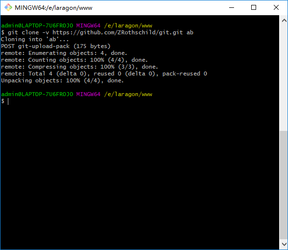
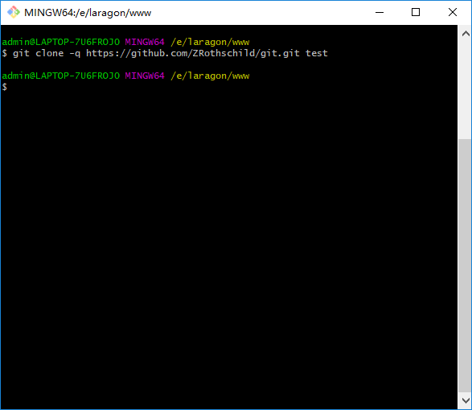
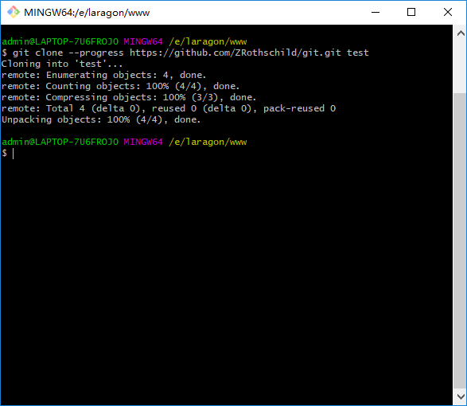
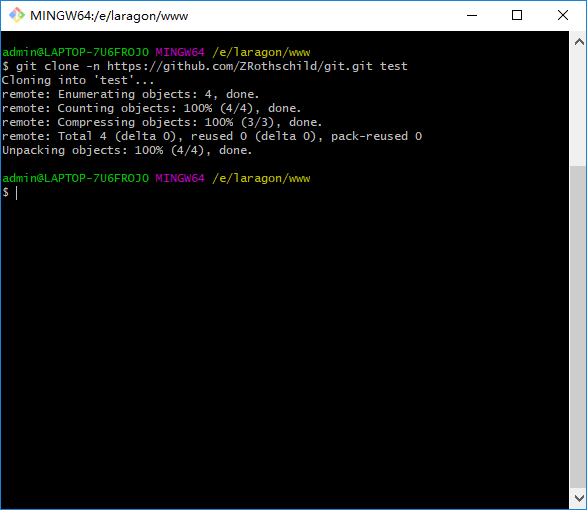

# git clone 用法

###  git clone 命令格式

> git clone `[options]` `[--]` `<repo>` `[<dir>]`

###  git clone 参数


| 选项  | 英文注解   |  中文注解  |
| :--------: | :-----:  | :----:|
| -v, --verbose  | be more verbose | 会打印出被拉取的项目详情，进度，错误等 |
| -q, --quiet   | be more quiet | 与`-v`相反,什么都不对打印 |
| --progress  | force progress reporting | 强制进度报告 |
| -n, --no-checkout  | don't create a checkout | 只会拉取`.git`文件,项目文件需要自行`pull` |
| --bare  | create a bare repository | 制作一个简单的`Git`存储库.也就是说,不是创建`<directory>`并将管理文件放在`<directory>/.git`中,而是将`<directory>`本身设为`$GIT_DIR`.这显然意味着`-n`因为无处可查看工作树.远程处的分支头也直接复制到相应的本地分支头,而不将它们映射到`refs/remotes/origin/`.使用此选项时,既不会创建远程跟踪分支,也不会创建相关的配置变量.不包含工作区 |
| --mirror  | create a mirror repository (implies bare) | 设置源存储库的镜像.这意味着`-bare`.与`--bare`相比,`-mirror`不仅将源的本地分支映射到目标的本地分支,它还映射所有引用(包括远程跟踪分支,注释等)并设置`refspec`配置,以便所有这些引用被目标存储库中的`git`远程更新覆盖. |
|  -l, --local | to clone from a local repository | 优先从本地文件克隆 |
| --no-hardlinks  | don't use local hardlinks, always copy |  xx |
| -s, --shared  | setup as shared repository |  xx |
|  --recurse-submodules`[=<pathspec>]` | initialize submodules in the clone |  xx |
|  -j, --jobs `<n>` | number of submodules cloned in parallel |  xx |
| --template `<template-directory>`  | directory from which templates will be used |  xx |
| --reference `<repo>`  | reference repository |  xx |
|  --reference-if-able `<repo>` | reference repository |  xx |
|  --dissociate | use --reference only while cloning  |  xx |
| -o, --origin `<name>`  | use <name> instead of 'origin' to track upstream |  xx |
| -b, --branch `<branch>`  | checkout <branch> instead of the remote's HEAD |  xx |
| -u, --upload-pack `<path>`  | path to git-upload-pack on the remote |  xx |
| --depth `<depth>`  | create a shallow clone of that depth |  xx |
| --shallow-since `<time>`  | create a shallow clone since a specific time |  xx |
| --shallow-exclude `<revision>`  | deepen history of shallow clone, excluding rev |  xx |
| --single-branch  | clone only one branch, HEAD or --branch |  xx |
| --no-tags  | don't clone any tags, and make later fetches not to follow them |  xx |
| --shallow-submodules  | any cloned submodules will be shallow |  xx |
| --separate-git-dir `<gitdir>`  | separate git dir from working tree |  xx |
| -c, --config `<key=value>`  | set config inside the new repository |  xx |
|  -4, --ipv4 | use IPv4 addresses only |  xx |
|  -6, --ipv6 | use IPv6 addresses only |  xx |
                            

###  `git clone -v  https://github.com/ZRothschild/git.git`
> 印出被拉取的项目详情，进度，错误



###  `git clone -q  https://github.com/ZRothschild/git.git`
> 与`-v`相反,什么都不对打印



###  `git clone --progress  https://github.com/ZRothschild/git.git`
> 强制打印进度报告



###  `git clone -n  https://github.com/ZRothschild/git.git`
>  只会拉取`.git`文件,项目文件需要自行`pull`




###  `git clone --bare  https://github.com/ZRothschild/git.git`
> 制作一个简单的`Git`存储库.也就是说,不是创建`<directory>`并将管理文件放在`<directory>/.git`中,而是将`<directory>`本身设为`$GIT_DIR`.
> 这显然意味着`-n`因为无处可查看工作树.远程处的分支头也直接复制到相应的本地分支头,而不将它们映射到`refs/remotes/origin/`.
> 使用此选项时,既不会创建远程跟踪分支,也不会创建相关的配置变量.不包含工作区.


> 拉取文件示例


>  `config`文件配置信息

```go
[core]
	repositoryformatversion = 0
	filemode = false
	bare = true
	symlinks = false
	ignorecase = true
[remote "origin"]
	url = https://github.com/ZRothschild/git.git
```

###  `git clone --mirror  https://github.com/ZRothschild/git.git`
> 是`--bare`升级命令
> 所有引用中的每一个都将按原样复制.您将获得所有标签，本地分支,远程分支,以及其他.一切都与克隆的仓库完全一样.
> 设置远程跟踪,这样如果你运行`git`远程更新,所有引用都将被覆盖,就好像你刚刚删除了镜像并重新克隆它一样.
> 正如文档最初所说,它是一面镜子.它应该是功能相同的副本,可与原始副本互换.


> 拉取文件示例与`--bare`一样,只是配置文件不同


>  config 文件配置信息

```go
[core]
	repositoryformatversion = 0
	filemode = false
	bare = true
	symlinks = false
	ignorecase = true
[remote "origin"]
	url = https://github.com/ZRothschild/git.git
	fetch = +refs/*:refs/*
	mirror = true
```
